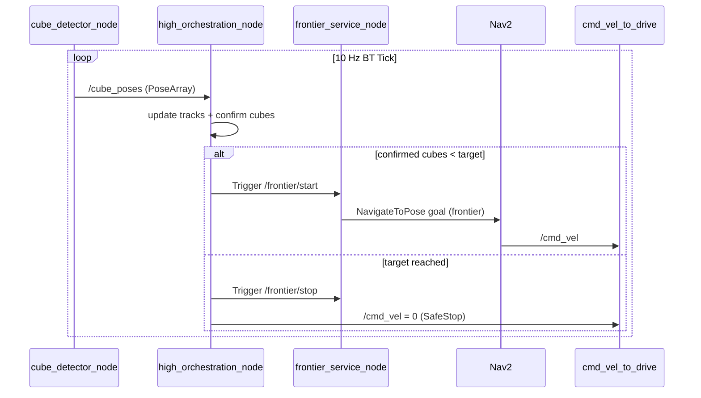
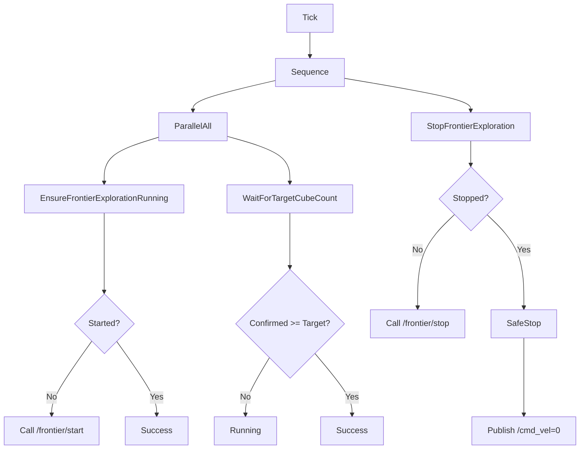

# Autonomy Visuals

This page emphasizes visual understanding over prose.

## 1) Layered System Map

```mermaid
flowchart LR
  classDef sensor fill:#E8F1FF,stroke:#2D6CDF,stroke-width:1.5,color:#102A43;
  classDef perceive fill:#E9FFF4,stroke:#00A86B,stroke-width:1.5,color:#123524;
  classDef mission fill:#FFF4E8,stroke:#D97706,stroke-width:1.5,color:#4A2D00;
  classDef nav fill:#F4ECFF,stroke:#7C3AED,stroke-width:1.5,color:#2B0A57;
  classDef control fill:#FFECEC,stroke:#C0392B,stroke-width:1.5,color:#5A1A16;
  classDef topic fill:#F8FAFC,stroke:#64748B,stroke-dasharray: 4 3,color:#0F172A;

  subgraph S[Sensor Layer]
    RGB[RGB Image]
    DEP[Depth Image]
    INF[Camera Info]
    MAP[/map]
  end

  subgraph P[Perception Layer]
    DET[cube_detector_node]
  end

  subgraph R[Reactive Layer]
    CHASE[cube_chase_controller]
  end

  subgraph M[Mission Layer]
    ORCH[high_orchestration_node]
    FRON[frontier_service_node]
  end

  subgraph N[Navigation Layer]
    NAV2[NavigateToPose\nAction Server]
  end

  subgraph C[Control Layer]
    CMD[/cmd_vel]
    DRIVE[cmd_vel_to_drive]
    WHL[/wheel_velocity_controller/commands]
  end

  subgraph O[Observability]
    ST[/orchestrator/state]
    CJ[/orchestrator/cubes_json]
    MK[/cube_markers]
    DJ[/cube_detections_json]
  end

  RGB --> DET
  DEP --> DET
  INF --> DET

  DET -->|/cube_poses| CHASE
  DET -->|/cube_poses| ORCH
  DET --> DJ
  DET --> MK

  ORCH -->|Trigger /frontier/start| FRON
  ORCH -->|Trigger /frontier/stop| FRON
  ORCH --> ST
  ORCH --> CJ

  MAP --> FRON
  FRON -->|goal| NAV2

  CHASE --> CMD
  NAV2 --> CMD
  ORCH -->|safe stop| CMD

  CMD --> DRIVE
  DRIVE --> WHL

  class RGB,DEP,INF,MAP sensor;
  class DET perceive;
  class CHASE reactive;
  class ORCH,FRON mission;
  class NAV2 nav;
  class CMD,DRIVE,WHL control;
  class ST,CJ,MK,DJ topic;
```

## 2) Mission Behavior Timeline



## 3) Behavior Tree View



## 4) Command Source Priority (Practical)

There is no command multiplexer in this repo. `/cmd_vel` can be written by:

1. `cube_chase_controller`
2. Nav2
3. `high_orchestration_node` (SafeStop)

Practical result: last writer wins.
