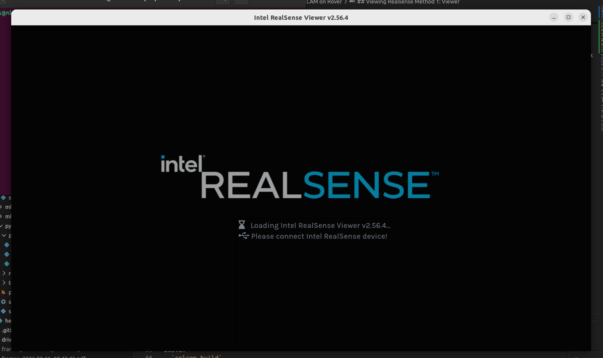
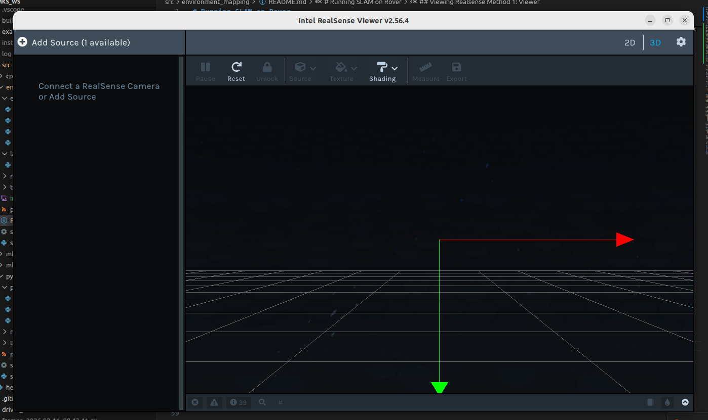

# Running SLAM on Rover

So you want to run slam, eh?

## Hardware
- Intel RealSense D435i Camera
- USB 3.0 Cable
- Computer running Ros2 Humble

## Software
- Python 3 and C++ 20 (should already be required by Ros2 Humble)

## Testing RealSense Prerequisites:
- `sudo apt update`
- `sudo apt install ros-humble-realsense2-camera`
- `sudo apt install ros-humble-rviz2`
- `sudo apt install ros-humble-rqt-image-view`

## SDK [OPTIONAL]

This section is optional. If down the line something doesn't work, installing the realsense SDK and retrying might fix it.

Add the intel RealSense repository and key. If this fails, try asking chat GPT "how to add intel realsense repository to install realsense SDK".

```bash
sudo mkdir -p /etc/apt/keyrings
curl -sSf https://librealsense.realsenseai.com/Debian/librealsenseai.asc \
  | gpg --dearmor | sudo tee /etc/apt/keyrings/librealsenseai.gpg > /dev/null

echo "deb [signed-by=/etc/apt/keyrings/librealsenseai.gpg] \
  https://librealsense.realsenseai.com/Debian/apt-repo $(lsb_release -cs) main" \
  | sudo tee /etc/apt/sources.list.d/librealsense.list
sudo apt update
```

The SDK itself
```bash
sudo apt install librealsense2-dkms librealsense2-utils
sudo apt install librealsense2-dev
```

Python library
```bash
pip3 install pyrealsense2
```
## Setup

- Connect camera to laptop using USB 3.0 cable and USB 3.0 port
- Test device is connected using `lsusb` and looking for 'Intel' or 'RealSense'

## Viewing Realsense Method 1: Viewer

This requires the realsense SDK

The viewer offers an easy ROS free GUI to change camera settings. The loading screen looks like this:


The UI looks like this:


When a D435 is connected you can enable or disable depth and colour. When a D435i is connected, you can enable or disable IMU (in theory, I have not tested IMU functionality in the GUI). The image should show up on the right side taking up the majority of screen.

## Viewing Realsense Method 2: ROS

1) Run the realsense node `ros2 launch realsense2_camera rs_launch.py`
2) Run `ros2 topic list` and make sure there are topics for camera and depth cam
2) Run the viewer with one of the following commands depending on if you want depth or colour:
  - `ros2 run rqt_image_view rqt_image_view /camera/camera/depth/image_rect_raw`
  - `ros2 run rqt_image_view rqt_image_view /camera/camera/color/image_raw`

### IMU

If using this method, you should also test the IMU.

1) Run this command:
`ros2 launch realsense2_camera rs_launch.py enable_gyro:=true enable_accel:=true unite_imu_method:=2`

If that does not work, try:
`ros2 launch realsense2_camera rs_launch.py enable_imu:=true enable_accel:=true enable_gyro:=true`

If that does not work, ask Chat GPT

2) Retry `ros2 topic list` and look for imu related topics
3) Subscribe to IMU topics and verify the IMU works (note the IMU topic name may be different)
`ros2 topic echo /imu`

Then move the IMU around and watch the figures change.

4) [OPTIONAL] Calibrate IMU. I did this months ago so it needs a recalib. See instructions here:
https://www.realsenseai.com/wp-content/uploads/2019/07/Intel_RealSense_Depth_D435i_IMU_Calibration.pdf

It may take 10 minutes+ to do.

## Installing Tools for RTABmap

- `sudo apt-get install ros-humble-rtabmap-ros`
- `sudo apt-get install ros-humble-imu-tools`

Madgwick filter is used to convert orientation to a quaternion
- `sudo apt install ros-humble-imu-filter-madgwick`

## Running RTABMap nodes

> You can open a tmux session for this

1) Run camera node: `ros2 launch realsense2_camera rs_launch.py`
2) Run madgwick node:
```bash
ros2 run imu_filter_madgwick imu_filter_madgwick_node \
  imu_topic:=/camera/camera/imu \
  output_imu_topic:=/imu/data
```
You will get warning when running madgwick, you can ignore it
```bash
[WARN] [1770762405.174334383] [rcl]: Found remap rule 'imu_topic:=/camera/camera/imu'. This syntax is deprecated. Use '--ros-args --remap imu_topic:=/camera/camera/imu' instead.
```

3) Launch RTAB node itself:
Note this command uses the remapping from madgwick as IMU source, you can change it.
```bash
ros2 launch rtabmap_launch rtabmap.launch.py \
  rgb_topic:=/camera/camera/color/image_raw \
  depth_topic:=/camera/camera/depth/image_rect_raw \
  camera_info_topic:=/camera/camera/color/camera_info \
  imu_topic:=/camera/camera/imu \
  frame_id:=camera_link
```

RTABMap will run and only stop running when you close the node. By default it will save your stream as an sqlite .DB file in `~/.ros/`

**WARNING** Running RTABmap is super data heavy. Running the camera for about 20 seconds generated a 20MB file. So don't leave it running! For testing cut it after 1-2 min max. We can adjust the density of sampling later.

## Post Processing

To see the output of your capture you need to do a few things. 

## Prerequisites
Install RTABmap database viewer

```bash
sudo apt install ros-humble-rtabmap ros-humble-rtabmap-ros
```
Install meshlab
```bash
sudo apt install meshlab
```

## Steps

Replace `mks` with your name

1) Move file to somewhere accessible:
```bash
mv /home/mks/.ros/rtabmap.db /home/mks/my_map.db
```

2) Open in the database viewer:
```bash
rtabmap-databaseViewer rtabmap.db
```

3) Export as `.ply` pointcloud file

4) Open meshlab, then click `Import` -> `Import Mesh` and navigate to and select your `.ply`


## Other Junk

Build:
- `colcon build`
- `source install/setup.bash`

Test:
- `lsusb` look for intel

In rviz:
1) add (bottom left) -> image
2) set topic

Optional:
- `ros2 run rqt_image_view rqt_image_view`
- `ros2 run rqt_image_view rqt_image_view /camera/camera/depth/image_rect_raw`
- `ros2 run rqt_image_view rqt_image_view /camera/camera/color/image_raw`

Run:
- `ros2 launch realsense2_camera rs_launch.py`
- `ros2 run rviz2 rviz2`
- `ros2 run environment_mapping pointcloud_accumulator`

## rtabmap

- `sudo apt-get install ros-humble-rtabmap-ros`
- `sudo apt-get install ros-humble-imu-tools`
- `ros2 launch environment_mapping rtabmap_realsense.launch.py`


## Other:
`ros2 launch rtabmap_launch rtabmap.launch.py   rgb_topic:=/camera/color/image_raw   depth_topic:=/camera/depth/image_rect_raw   camera_info_topic:=/camera/color/camera_info   imu_topic:=/camera/imu/data   frame_id:=camera_link   rviz:=true`

```bash
sudo apt update
sudo apt install ros-humble-image-transport \
                 ros-humble-image-transport-plugins \
                 ros-humble-cv-bridge
```

```bash
ros2 launch realsense2_camera rs_launch.py enable_imu:=true enable_accel:=true enable_gyro:=true
```

```bash
ros2 launch realsense2_camera rs_launch.py enable_gyro:=true enable_accel:=true unite_imu_method:=2
```

```bash
ros2 launch rtabmap_launch rtabmap.launch.py \
  rgb_topic:=/camera/camera/color/image_raw \
  depth_topic:=/camera/camera/depth/image_rect_raw \
  camera_info_topic:=/camera/camera/color/camera_info \
  imu_topic:=/camera/camera/imu \
  frame_id:=camera_link
```

```
rtabmap-databaseViewer rtabmap.db
```

## Remapping imu with ekf

```bash
ros2 run imu_filter_madgwick imu_filter_madgwick_node \
  imu_topic:=/camera/camera/imu \
  output_imu_topic:=/imu/data
```

you will get warning
```
[WARN] [1770762405.174334383] [rcl]: Found remap rule 'imu_topic:=/camera/camera/imu'. This syntax is deprecated. Use '--ros-args --remap imu_topic:=/camera/camera/imu' instead.
```

```bash
mv /home/mks/.ros/rtabmap.db /home/mks/my_map.db
```

## To run rtab you need the following
1) camera node
2) madgewick
3) rtabmap itself

## Post processing
1) open database viewer, open .db file
2) export as ply (pointcloud)
3) view in meshlab